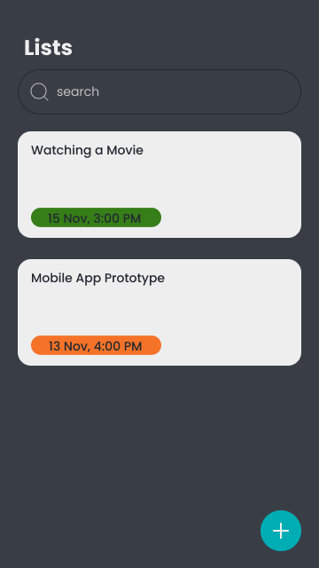

# Trollo by PAPB2022_4

[](https://shields.io/)

A mobile app Trello spin-off. Simple to-do list mobile app.

## Overview

This is a simple to-do list mobile app created using MVVM Architecture.

There will be 3 simple feature:

* View list of tasks
* Add task to the list
* Edit or delete task

Package directory:

```bash
| - src/main/java/com/example/trollo : activities, fragments & adapter
  | - model: data model declarations
  | - viewModel: ViewModel & ViewModelFactory
```

## Our Plan

Here are the screenshots of our prototype.



Adding task to the list

 

Opening up task detail and delete it from the list

 

This project will aim to showcases the features of Android such as:

* Fragments
* MVVM Architecture
* Navigation resource
* Database
* RecyclerView
* Popping destinations from the back stack
* Logging
* Behavior implementation on Activity/Fragment Lifecycles
* Toast!

## Our Team

Kode kelompok: **PAPB2022_4**

- Tiara Kesuma Putri (19/446787/TK/49892)
- Muhammad Raihan (19/439817/TK/48547)
- Aditya Dwi Cahyo Putra (19/444035/TK/49231)

Pengembangan Aplikasi Perangkat Bergerak

Tahun Akademik 2022/2023

Teknologi Informasi

Departemen Teknik Elektro dan Teknologi Informasi

Universitas Gadjah Mada